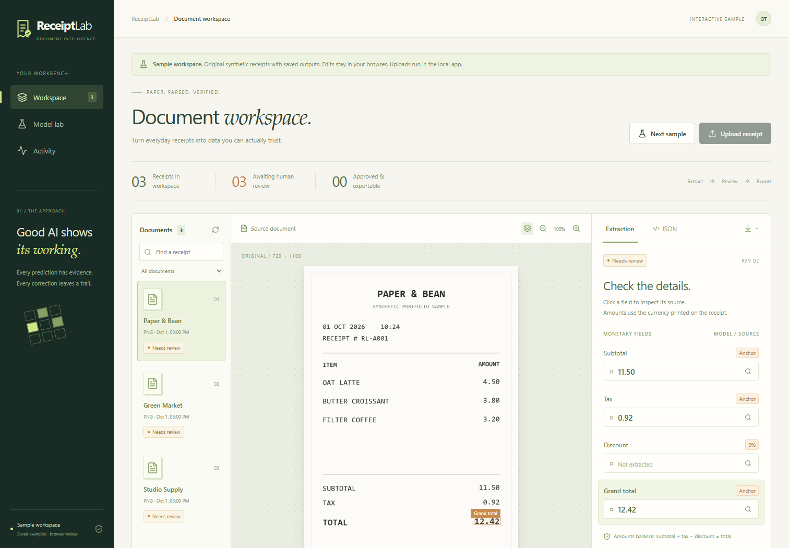

# ReceiptLab

**Multimodal receipt extraction, reproducible ML experiments, and a review workspace that keeps evidence visible.**

[Interactive demo](https://3amooor.github.io/receiptlab/) · [Evaluation](reports/evaluation.json) · [Transformer results](reports/transformer-evaluation.json) · [Model card](reports/model-card.md)

ReceiptLab takes a PNG, JPEG, or single-page PDF through real local OCR, a trained line classifier, deterministic validation, and human review. Inspect highlighted source boxes, correct fields and items, reconcile amounts, approve a revision, and download JSON or spreadsheet-safe CSV. SQLite preserves the original extraction and correction history.

The public demo contains **three original synthetic receipts with precomputed real outputs**. Edits stay in your browser. Uploads and live inference run in the local application.

## What was built

- Trained TF-IDF/geometry classifier, neighboring text, multiclass logistic regression, and validation-only probability calibration.
- Fine-tuned **LayoutLMv3** using receipt pixels, text, and boxes; three GPU epochs with the checkpoint selected on validation.
- Rules baseline, held-out class metrics, financial-field accuracy, separate real OCR evaluation, latency, provenance, and failure analysis.
- React/TypeScript interface, FastAPI worker, durable SQLite jobs, image/PDF decoding, deduplication, stale-edit checks, arithmetic approval gates, audit history, and exports.
- pytest, Playwright, dependency checks, GitHub Actions, and a genuine container smoke test.

## Measured results

Official CORD-v2 document split: **800 train / 100 validation / 100 test**. Nine line roles. Classifier results use **supplied annotated text and boxes** and exclude OCR errors.

| Experiment | Test macro F1 | Test line accuracy / micro F1 |
|---|---:|---:|
| Rules baseline | 0.624 | 72.2% |
| Calibrated TF-IDF + logistic regression | 0.939 | [Full report](reports/evaluation.json) |
| Fine-tuned LayoutLMv3 | **0.957** | **97.9%** |

Actual OCR materially changes performance. On a seeded 20-document test sample, the classical model recovered **1/18 present unambiguous totals**. Printed-label assistance recovered **10/18** on the same sample. Assistance was added after failure analysis, fixed before separate validation, and measured as an additional operational experiment. **It is not learned-model accuracy.** Every assisted receipt requires human review; anchor values carry no learned confidence.

See [raw OCR results](reports/evaluation.json), [assisted validation](reports/validation-assisted-evaluation.json), [assisted test](reports/test-assisted-evaluation.json), and [failure analysis](docs/failure-analysis.md). These are Indonesian receipt results; they do not establish invoice, Arabic, or general financial accuracy.

## Run locally

Requires Python **3.12** and Node.js **22**. No paid API keys. The small trusted classical artifact is included.

~~~bash
git clone https://github.com/3amooor/receiptlab.git
cd receiptlab
python -m venv .venv
~~~

Activate the virtual environment: .venv\Scripts\Activate.ps1 on Windows, or source .venv/bin/activate on macOS/Linux. Then:

~~~bash
python -m pip install -r requirements-dev.txt
cd frontend
npm ci
npm run build
cd ..
python -m uvicorn receiptlab.api:app --host 127.0.0.1 --port 8010
~~~

Open **http://127.0.0.1:8010**. Choose **Try a sample** or upload a receipt. On Windows, scripts/start.ps1 starts the installed application. Uploaded files and SQLite stay in ignored data/workspace.

For frontend development, run npm run dev inside frontend with the API running. This is a **single-user local application**. Authentication and deployment hardening are additional work before exposing its API publicly.

## Optional fine-tuned transformer

Default serving uses the small classical model. LayoutLMv3 research weights are a [versioned release asset](https://github.com/3amooor/receiptlab/releases/tag/v1.0.0), with SHA256 hashes. They inherit the base model's **CC-BY-NC-SA-4.0** license. The MIT code license does not override it.

~~~bash
python -m pip install -r requirements-train.txt
# Install a PyTorch build appropriate for your hardware.
python scripts/download_model.py --accept-noncommercial-license
~~~

Set RECEIPTLAB_MODEL_BACKEND=transformer and run the same API. In PowerShell:

~~~powershell
$env:RECEIPTLAB_MODEL_BACKEND = 'transformer'
python -m uvicorn receiptlab.api:app --host 127.0.0.1 --port 8010
~~~

Both backends were exercised through real OCR and API workers on original fixtures. The transformer conservatively withheld conflicting subtotals; [actual serving outputs](reports/smoke-transformer.json) show this behavior.

## Reproduce experiments

See [training instructions](docs/training.md) and [tested environment](reports/environment.txt). The public dataset requires internet and several GB of disk.

~~~bash
python -m pip install -r requirements-train.txt
python -m training.data --data-dir data/cord
python -m training.train
python -m training.evaluate --ocr-documents 20
python -m training.transformer_train --epochs 3
python -m training.assisted_evaluate --split validation --documents 20
python -m training.assisted_evaluate --split test --documents 20
python -m scripts.build_demo
~~~

For optional MLflow tracking, set MLFLOW_ALLOW_FILE_STORE=true and run python -m training.train --mlflow-uri ./mlruns. MLflow records the classical experiment; transformer history is saved directly in JSON.

Training checks document separation and complete chunk coverage. Token counts explicitly reset fast-tokenizer padding state; regressions protect against a bug that otherwise creates padded windows from short lines. Oversized single lines may still be truncated: unrepresented lines are counted and retain zero confidence.

## Verify

~~~bash
python -m pip check
python -m ruff check receiptlab training tests scripts
python -m pytest
cd frontend
npm run build
npm run build:demo
npx playwright install chromium
npm run test:e2e
~~~

Local verification: **52 backend tests and 7 browser tests**, plus real OCR/API inference with both models. pytest used an isolated project temporary directory because the machine's shared Windows pytest directory was inaccessible.

Backend checks cover malformed/oversized files, PDF decoding, deduplication, interrupted jobs, atomic claims, revisions, strict money inputs, arithmetic, CSV formula escaping, source provenance, and chunk accounting. Browser checks cover source previews, evidence, zoom, correction persistence, approval, audit, exports, report scope, mobile overflow, and runtime errors. GPU experiments and genuine inference are recorded separately from fixture-based tests.

## Container

Build the frontend first, then:

~~~bash
docker compose up --build
~~~

Open http://127.0.0.1:8010. Compose publishes only to loopback and persists workspace data. GitHub CI builds the container and checks its UI, model readiness, and actual OCR extraction.

## Architecture and attribution

[Architecture](docs/architecture.md) · [Data/model licenses](docs/data-and-models.md) · [Resume bullets](docs/resume-bullets.md)

Original code and synthetic fixtures: MIT. CORD-v2: NAVER CLOVA, CC-BY-4.0. LayoutLMv3: Microsoft, CC-BY-NC-SA-4.0. RapidOCR and its packaged ONNX models retain upstream licenses.

Strong extraction metrics on annotated text can coexist with weak OCR performance. ReceiptLab makes that gap measurable and keeps human correction inside the product.
