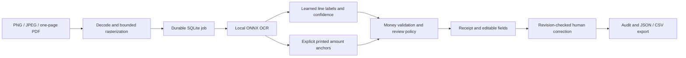

# ReceiptLab architecture

ReceiptLab turns a receipt image into inspectable structured data using a learned
document model. The application is a local single-user portfolio implementation.

## Responsibilities

- **Ingestion** validates file signatures, decoded dimensions and page limits;
  hashes uploads; stores them with UUID filenames and deduplicates repeats.
- **Worker** processes persisted jobs, records failures, and recovers jobs after
  a single-worker restart. SQLite deliberately keeps the local setup small.
- **OCR** runs ONNX models locally and returns text, boxes, and OCR confidence.
- **Learned extraction** classifies OCR lines from lexical, layout and context
  features. A transformer experiment adds pretrained text/image/layout representations.
- **Validation** parses bounded decimal amounts and checks arithmetic independently
  of model scores. Uncertain, inconsistent or missing values require review.
- **Text assistance** uses explicit printed labels and same-row monetary evidence,
  preserves raw learned predictions, withholds conflicts, and assigns no learned
  confidence to recovered values. Every assisted result requires human approval.
- **Review** keeps original extraction immutable, checks the document revision,
  records changes, and exports the current human-reviewed values.

## Experiment boundaries

CORD official train/validation/test splits remain separated. Training learns weights;
validation selects thresholds; test estimates held-out performance. Benchmark supplied
text and boxes are an extraction experiment. An independently reported OCR subset
runs actual image-to-text inference and includes upstream OCR errors.

Reports include sample counts, split hashes, model version, per-class metrics,
baseline comparison, latency and acceptance coverage. Synthetic English demo receipts
are original UI fixtures, never evidence of general English/Arabic invoice accuracy.

## Local service and public showcase

The local API processes uploads. The GitHub Pages frontend is a clearly labelled
sample workspace using precomputed synthetic outputs; it has no public upload service.
It permits local sample edits and exports to demonstrate the review interaction.

For multiple users or deployment, add authenticated ownership, secure sessions,
quotas, a dedicated worker queue, observability, retention/deletion policies and a
database migration strategy. Those are outside the local portfolio release.
